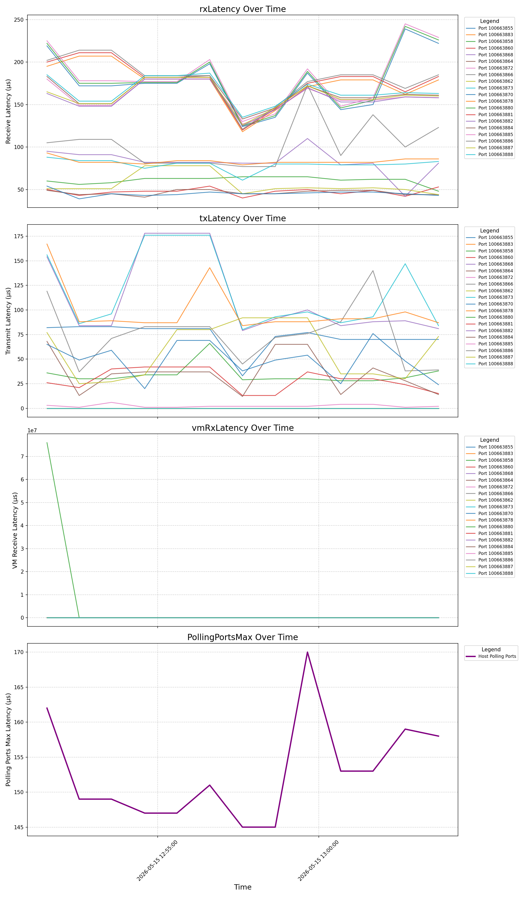

# NSX IvS Latency Analysis

This repository contains shell scripts used to collect and analyze NSX Industrial vSwitch (IvS) latency statistics for virtual PLC (vPLC) vNIC interfaces.

## Scripts Overview

1. **`ivs_collect_latency_stats_v3.sh`**: A script to run on the ESXi host to collect the IvS latency stats periodically.
2. **`ivs_analyze_lantecy_create_graph.sh`**: A script to run on a jump host or local machine (e.g., macOS/Linux) to parse the collected text files and generate a CSV and graphs.

---

## 1. Data Collection

The `ivs_collect_latency_stats_v3.sh` script is designed to run on the ESXi host where the vPLC is running. It collects latency statistics every 60 seconds (using a drift-corrected timer) and saves them to text files. The script automatically clears the stats every 3 minutes and stops after 3 days. It also includes compatibility checks for different ESXi builds (e.g., handling FastSlab metrics on GA vs Debug builds) and logs clearance events to a dedicated file.

### Usage

1. Copy `ivs_collect_latency_stats_v3.sh` to the ESXi host.
2. Make the script executable:
   ```bash
   chmod +x ivs_collect_latency_stats_v3.sh
   ```
3. Run the script:
   ```bash
   ./ivs_collect_latency_stats_v3.sh
   ```
   *(You can also run it in the background using `nohup` or `screen` if available).*

4. The script will generate files named `nsx_combined_YYYYMMDD_HHMMSS.txt` in the `/tmp/nsx_stats` directory. It will also generate a `clearance_events.log` file in the same directory to track when the stats are reset.

---

## 2. Data Analysis

Once the data collection is complete, export the generated `.txt` files from the ESXi host to your local machine or a jump host.

The `ivs_analyze_lantecy_create_graph.sh` script processes these text files, extracts the relevant latency metrics, and generates visual graphs.

### Usage

1. Place all the collected `nsx_combined_*.txt` files in a single directory.
2. Place `ivs_analyze_lantecy_create_graph.sh` in the same directory.
3. Make the script executable:
   ```bash
   chmod +x ivs_analyze_lantecy_create_graph.sh
   ```
4. Run the script:
   ```bash
   ./ivs_analyze_lantecy_create_graph.sh
   ```

### Output

The analysis script will generate the following files in the same directory:
* **`maxLatency_per_vnic.csv`**: A CSV file containing the parsed latency data.
* **`latency_4_graphs.png`**: An image file containing 4 subplots visualizing the latency over time:
  * Receive Latency
  * Transmit Latency
  * VM Receive Latency
  * Host Polling Ports Max Latency

*Note: The analysis script dynamically generates and executes a Python script (`plot_latency_automated.py`) to create the graphs. It will also create a temporary Python virtual environment (`.nsx_venv`) if the required libraries (`pandas`, `matplotlib`) are not already installed on your system. You do not need to run any Python scripts manually.*

---

## Sample Outputs

### Generated Graph (`latency_4_graphs.png`)
Below is an example of the graph generated by the analysis script, visualizing the latency metrics over time across different vNICs.



### Raw Data Sample (`nsx_combined_*.txt`)
Here is a sample of what the raw text files generated by the collection script look like. The analysis script parses this data to extract the `maxLatency` for each `PortID`.

<details>
<summary>Click to expand raw data sample</summary>

```text
========================================
CAPTURE TIME: 2026-05-15 12:51:34
========================================

COMMAND 1: nsxdp-cli ens latency system dump -s 0
----------------------------------------
Latency histogram after cumulating all lcores result
Latency         Uplink Tx       Polling ports   Scheduling the lcore   ENS Slowpath   
TotalSamples    13516301        21561707        1807447                33908          
minLatency      1               1               0                      1              
maxLatency      206             162             9                      140            
mean            3               2               0                      40             
...
PortID: 100663855 SampleRate: 1 enableE2E: 1
Latency         txLatencyHisto       rxLatencyHisto       vmRxLatencyHisto     intrLatencyHisto    
TotalSamples    16980                8039                 8040                 18722               
minLatency      0                    1                    8                    0                   
maxLatency      82                   219                  246                  13                  
mean            12                   27                   43                   3                   
...
========================================

COMMAND 2: nsxdp-cli ens prp stats lcore list -a 0 -s 0
----------------------------------------
Stats Name                   lcore 0          lcore 1          lcore 2          lcore 3          
================================================================================================
txPkts                       185086612226     129852961532     66840956187      67324023794      
txBytes                      12806850244323   8940707621770    4573165929583    4632845940469    
rxPkts                       215738733417     131380168685     67850310182      74109071219      
...
Internal Stats
================================================================================================
mbufAllocFailure             0                0                0                0                
mbufAllocs                   45738            21870            62658            23898            
...
maxPollIVTimeInUS            587              587              587              587              

========================================

COMMAND 3: EnsSlab deallocTimeHisto
----------------------------------------
Slab: EnsSlab_1
...
(Or a fallback message if the host build does not support this metric)

========================================
End of Capture
```
</details>
